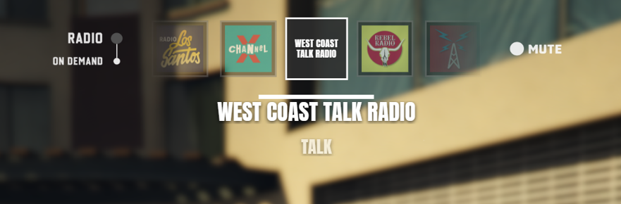
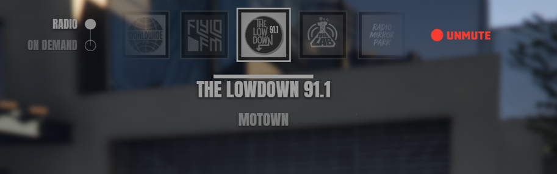
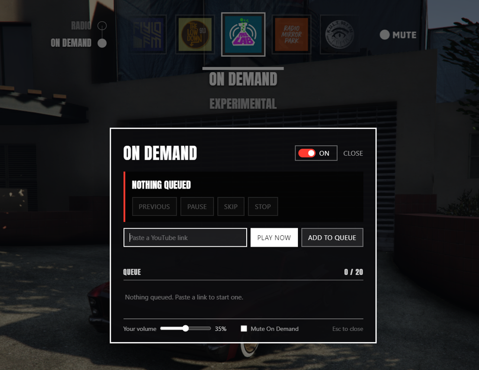

# GTA VI Radio for FiveM

A FiveM port of **VI Radio**, the GTA V Legacy singleplayer mod by *sej0bec*: a
GTA VI–styled radio carousel, a mute system, station logos, and a slow-motion
effect while you browse stations. Plus **On Demand** — play YouTube links
through the car radio, as a shared queue everyone in earshot hears.

No framework dependency. On Demand needs [xsound](https://github.com/Xogy/xsound)
installed; without it the wheel still works and On Demand switches itself off.





## Install

1. Copy the `vi_radio` folder into your server's `resources/` directory.

   > The folder **must** be named `vi_radio`. If you cloned this repo, rename the
   > checkout — the resource name is what `exports['vi_radio']` resolves to.

2. Add to `server.cfg`:

   ```
   ensure vi_radio
   ```

3. Tune `config.lua` to taste.

4. For On Demand, make sure `xsound` is started **before** `vi_radio`. Set
   `Config.OnDemand.enabled = false` if you do not want it at all.

## Controls

| Action | Keyboard | Controller |
| --- | --- | --- |
| Open the radio wheel | Hold **Q** | Hold **D-pad Left** |
| Previous / next station | **←** / **→**, or the mouse wheel | **Right stick** left / right, or **D-pad Up** / **D-pad Right** |
| Mute / unmute | **O** anywhere, or **Space** while the wheel is open | **D-pad Down** while the wheel is open |
| Throw the radio / On Demand switch | **↓** for On Demand, **↑** for radio | **Right stick** down / up |
| Open the On Demand panel | **↓**, then release the wheel — or `/ondemand` | Same |

The switch works from anywhere in the wheel; there is nothing to scroll to. It
is thrown the way the artwork reads — `RADIO` is the top position, `ON DEMAND`
the bottom one — so down engages On Demand and up hands the radio back.

Up and down therefore belong to the switch, which is why mute moved: to Space on
a keyboard (the handbrake, no great loss while you are reading the radio) and to
D-pad Down on a pad, where nothing else is free. `O` still works everywhere,
wheel open or not. Set `Config.OnDemand.switchKeys = false` to leave up and down
alone and reach On Demand through the panel and `/ondemand` only.

The wheel is **vehicle-only**, for the driver or any passenger. Set
`Config.DriverOnly = true` to restrict it to the driver, or
`Config.AllowOnFoot = true` to extend it to the mobile radio on foot.

The keyboard keys are rebindable under **Settings → Key Bindings → FiveM**.

### How the controller binding works

The controller does **not** go through FiveM's key-binding system. A binding
registered with `RegisterKeyMapping` is only a *default*: once a client has
stored a binding for a command, a default added later never reaches it. So the
pad reads `INPUT_VEH_RADIO_WHEEL` directly — the game's own radio wheel control,
D-pad Left out of the box, and whatever the player has rebound it to otherwise.
The stock wheel is suppressed every frame so it cannot open on the same button.

Because that button is *held* to keep the wheel open, and is simultaneously
`INPUT_CELLPHONE_LEFT` and `INPUT_WEAPON_WHEEL_PREV`, it cannot also mean
"previous station" — holding it would step the station every frame. Browsing on a
pad is therefore the right stick (as in the vanilla wheel), with D-pad Up and
D-pad Right as discrete alternates. While browsing on a pad the camera is locked
so the right stick does not swing the view; set
`Config.Controller.lockCamera = false` if you would rather it did.

Mute has no global pad binding because no controller button is free while
driving, so it lives on D-pad Down inside the wheel. Set
`Config.Controller.enabled = false` to drop controller support entirely.

### Troubleshooting

Run `viradio_debug` in the client console (F8) while sitting in a vehicle. It
prints whether you are in a valid seat, how many stations were found, whether
the wheel thinks it is open, and the live state of the radio wheel control.

## On Demand



The icon to the left of the carousel is a two-position switch, `RADIO` over
`ON DEMAND`. It is the original mod's own artwork, redrawn so the knob can
actually move between the two positions — it slides down and `ON DEMAND` lights
up while `RADIO` dims, and back again. (With `Config.OnDemand.enabled = false`
the static artwork is shown instead, exactly as the original drew it.)

* **Down — On Demand.** The station that was playing is remembered, the game
  radio goes quiet, and letting go of the wheel opens the panel: paste a YouTube
  link (or a direct `.mp3` / `.ogg` / `.wav` URL) and either play it straight
  away or add it to the vehicle's queue.
* **Up — radio.** Playback stops and the remembered station comes back.

While On Demand has the audio, scrolling the carousel only *previews* stations —
it does not start one playing over the top of the track. The station you land on
is applied when you let go, and that is also what switches On Demand off.

The switch stays down when the queue runs out or is emptied — the vehicle is
simply silent until something else is queued — so "nothing playing" and
"switched off" are two different states. Reopen the panel at any time by
throwing the switch down again, with `/ondemand`, or from inside the panel.

* **Everyone nearby hears it.** The audio is positioned at the vehicle, so
  passengers and anyone stood close by hear the same track at the same point in
  it. `Config.OnDemand.distance` sets how far it carries.
* **Everyone can use it.** Anyone sitting in the vehicle can queue, skip, pause
  or stop — there is no job check and no permission gate. That is deliberate.
* **The server owns playback**, keyed by the vehicle's network id, so a
  passenger who joins halfway through a track hears it from the right place
  rather than starting it again.
* **Track titles** are looked up through YouTube's oEmbed endpoint (no API key)
  and drive the HUD's title and artist lines. Set
  `Config.OnDemand.fetchTitles = false` to stop the server making that request.

Because anyone can play anything, the panel also carries the two controls that
protect a listener without restricting who may broadcast: **your own volume**
(capped by `Config.OnDemand.maxVolume`) and a **mute all On Demand audio**
toggle. Both are per player, saved on that client, and affect nobody else.

Selecting an ordinary radio station also switches On Demand off — in that case
the station you just picked is kept, rather than the one that was remembered.

> **Worth knowing:** xsound plays YouTube through the IFrame API, which is not
> what YouTube's terms of service intend it for. It is how effectively every
> FiveM audio resource does it, and it is not enforced in practice, but it is
> your call to make before running this on a public server.

## Configuration

Everything lives in `config.lua`, mirroring the original mod's `VI Radio.ini`:

* **Controls** — keys, mouse-wheel scrolling, arrow auto-repeat, whether
  passengers and on-foot players can use it.
* **Feel** — `TimeScale`, timecycle modifier and strength, hi-DOF, radar hiding,
  open/close sounds and volume.
* **HUD** — tile size, spacing, colours, borders, slide time, side icons, the
  info-line and text positions. Values are authored at 1920x1080 and scale to
  the player's resolution.
* **Stations** — display label, logo and genre per station.
* **On Demand** — queue limit, audible distance, default and maximum listener
  volume, title lookup, accepted link types, and the sync/rate-limit timings.

When the radio is muted the indicator turns red (`Config.Hud.mutedColor`) and
the rest of the HUD drops to greyscale, so the two states cannot be mistaken for
each other at a glance. Set `Config.Hud.muteDim = false` to keep the colour and
recolour only the indicator.

## Adding or hiding stations

`Config.Stations` maps a game station name to its display label, logo file and
genre. Stations the game reports as unlocked but that are missing from the table
still appear, using a tidied version of their raw name and a text tile instead
of a logo. To drop one from the wheel:

```lua
['RADIO_05_TALK_01'] = { label = 'West Coast Talk Radio', hidden = true },
```

Logos live in `html/logos/` — drop in a PNG and reference it by filename.

## Exports

```lua
exports['vi_radio']:SetNowPlaying(title, artist)
exports['vi_radio']:IsOpen()        --> boolean
exports['vi_radio']:IsMuted()       --> boolean
exports['vi_radio']:SetMuted(bool)
exports['vi_radio']:GetStation()    --> current station name, or 'ONDEMAND'

-- On Demand (client)
exports['vi_radio']:IsOnDemandOn()       --> boolean, the switch position
exports['vi_radio']:IsOnDemandPlaying()  --> boolean, a track is actually running
exports['vi_radio']:SetOnDemand(bool)    --> flip the switch
exports['vi_radio']:GetOnDemandTrack()   --> { title, artist, paused, position } or nil
exports['vi_radio']:OpenOnDemand()

-- On Demand (server)
exports['vi_radio']:GetOnDemandSession(vehicleNetId)  --> session table or nil
exports['vi_radio']:StopOnDemand(vehicleNetId)
```

## Differences from the singleplayer mod

The original is a compiled ScriptHookVDotNet plugin. FiveM cannot load SHVDN
assemblies, so this is a rewrite rather than a drop-in conversion. The
behaviour, layout values, station list and artwork carry over; the
implementation does not.

* **HUD** — drawn with NUI (`html/`) instead of native textures. Every value
  from the `[HUD]` section of the original `.ini` is passed to the page as CSS
  variables, so the layout stays fully tunable.
* **Track title / artist — not available.** The singleplayer mod reads the
  current track's GXT text id and resolves it through the game's string table.
  FiveM exposes `GetAudibleMusicTrackTextId()` but has no native that turns that
  id back into text, so the title line is empty by default and the second line
  falls back to the station genre (`Config.Hud.subtitle`). If your server knows
  what is playing — custom streamed stations, xsound, a metadata feed — push it
  in:

  ```lua
  exports['vi_radio']:SetNowPlaying('Track title', 'Artist')
  -- or from the server:
  TriggerClientEvent('vi_radio:setNowPlaying', src, 'Track title', 'Artist')
  ```

* **Slow motion** — `SetTimeScale` is client-side only. While the wheel is open
  the player's vehicle drifts out of sync with what everyone else sees, and the
  longer the wheel is held the more visible that is. It is on by default to
  match the original feel; set `Config.TimeScale = 1.0` to keep only the HUD.
* **Mute** — uses `SetVehicleRadioEnabled` /
  `SetMobileRadioEnabledDuringGameplay` so the station is preserved, and is
  re-applied when the player changes vehicle.
* **In-game settings editor (F10)** — dropped. Edit `config.lua` instead.
* **Non-Stop-Pop song replacement** — the optional part of the original download
  is an OpenIV `.rpf` swap. On a server that would have to ship as a streamed
  audio pack for every client, so it is not included.

## Credits

* **sej0bec** (GTA5-Mods user `sbc17`) — VI Radio for GTA V Legacy Edition: the
  concept, HUD design, station logos, icons and sound effects. This port would
  not exist without it.
  Original mod: <https://www.gta5-mods.com/scripts/vi-radio-v1-0>
* **Vernon Adams** — the Anton typeface, SIL Open Font License 1.1.
* **Logopedia** (logos.fandom.com) — the station logos the original mod did not
  ship artwork for: West Coast Talk Radio, Blonded Los Santos 97.8, LS
  Underground Radio, iFruit Radio, Still Slipping Los Santos, Kult FM, The Music
  Locker, Media Player and MOTOMAMI Los Santos.
* **xsound** — the audio backend On Demand plays through.

## License

Code is released under the [PolyForm Noncommercial License 1.0.0](LICENSE.md).
You may use, modify and share it for any noncommercial purpose. You may **not**
use it, or anything derived from it, for commercial advantage or monetary
compensation — that includes selling it, bundling it into a paid package, and
putting it behind donation perks, subscriptions or any other paid tier.

The artwork and sound effects in `html/` are the work of **sej0bec** and are
redistributed here with credit; they are not covered by this license. Ask the
original author before reusing them elsewhere.

The nine station logos sourced from Logopedia are Rockstar Games' trademarks,
included here the same way any GTA fan resource includes them. They are not
covered by this license either.
